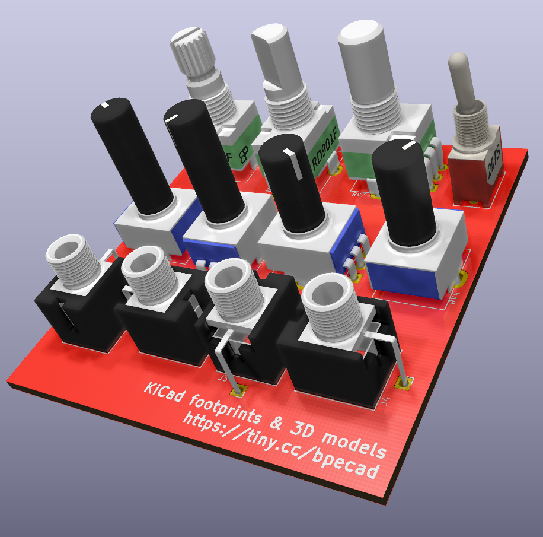

# ECAD Models (and symbols....and footprints)

Random libraries (symbols, footprints and models) I've created for using in my projects. Symbols and footprints are tested KiCad and DipTrace, but can probably be imported into other programs as well. The models should work in any program that accept STEP format files. 

## Usage

For now you can clone the repository and add the contents to where you have your KiCad libraries. Pointing to the repo directly from within KiCad should work, but is not tested yet. DipTrace libraries can be opened directly

## License and stuffs

Anything found in this repository is licensed under CC BY-SA 4.0. Read the fineprint here: [Creative Commons](https://creativecommons.org/licenses/by-sa/4.0/legalcode).

The libraries are provided as is. You use them at your risk. These work for me but I take no responsibility for any work based on anything found within this repository.

## Contributions

If you you're missing components or if you find something not working as expected feel free to open an issue and I'll take a look at it.
